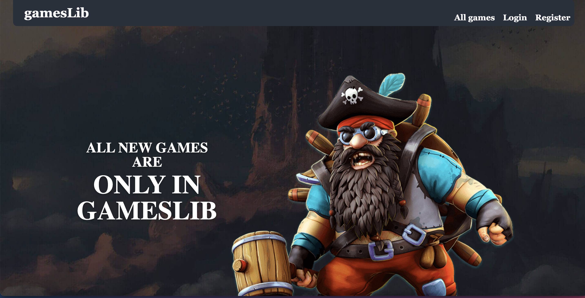
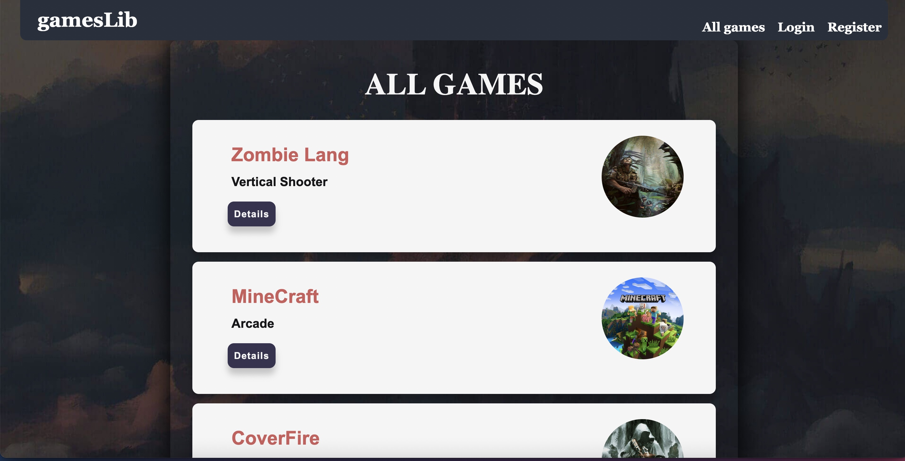
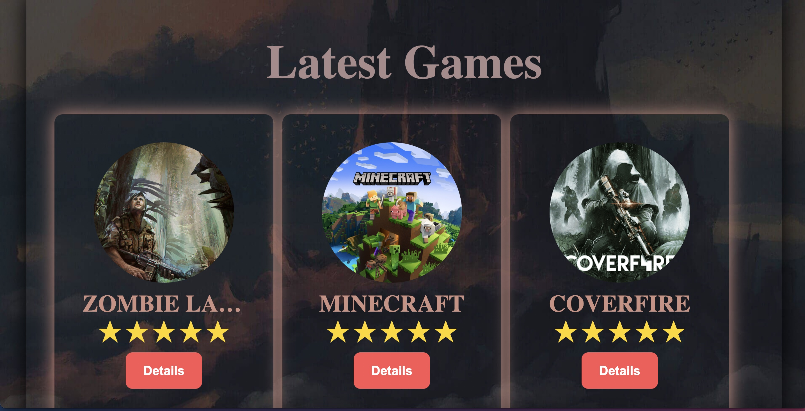
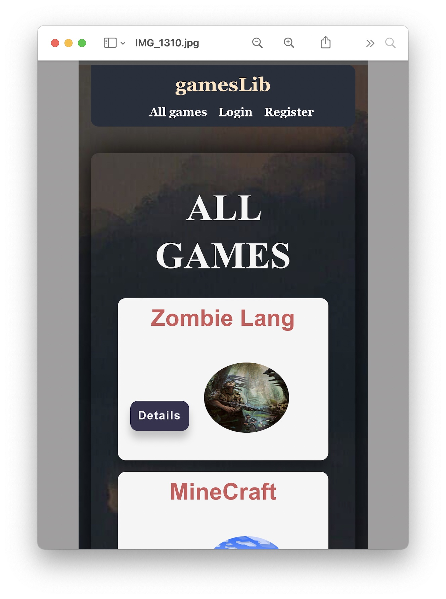
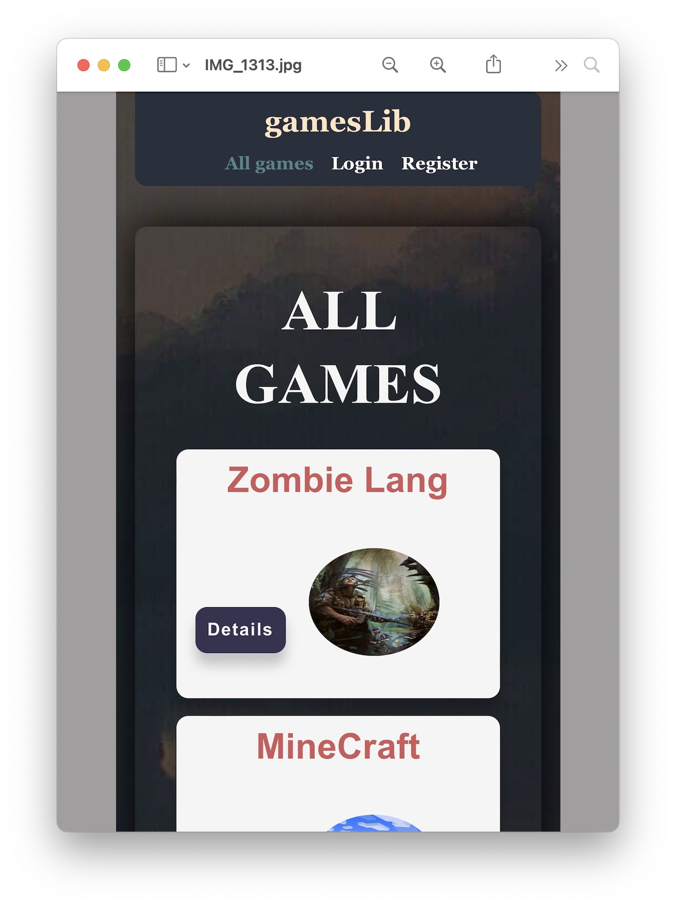
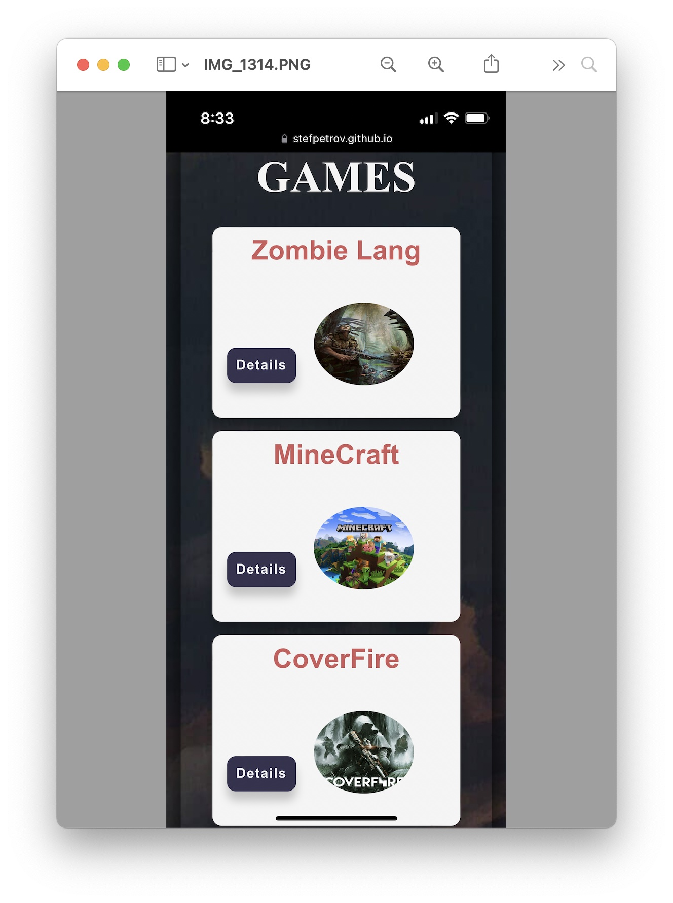
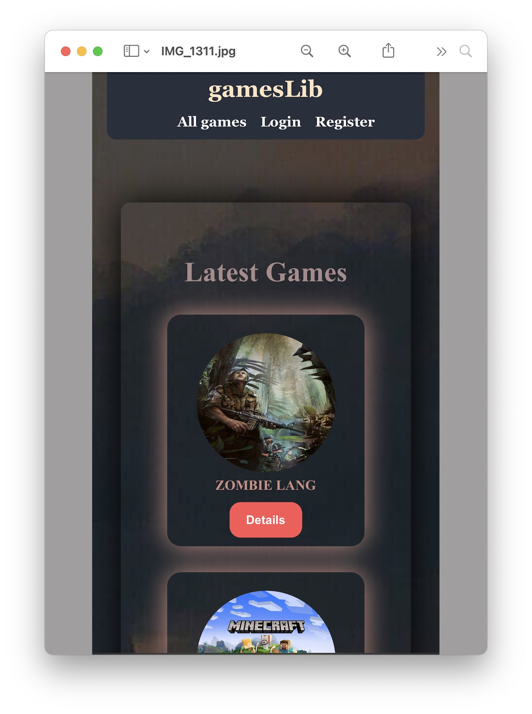
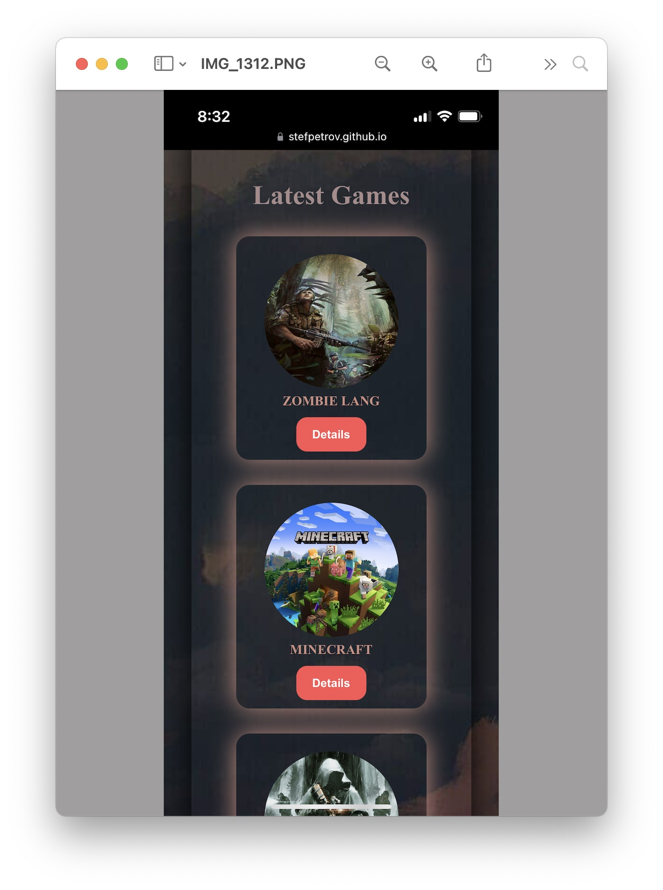
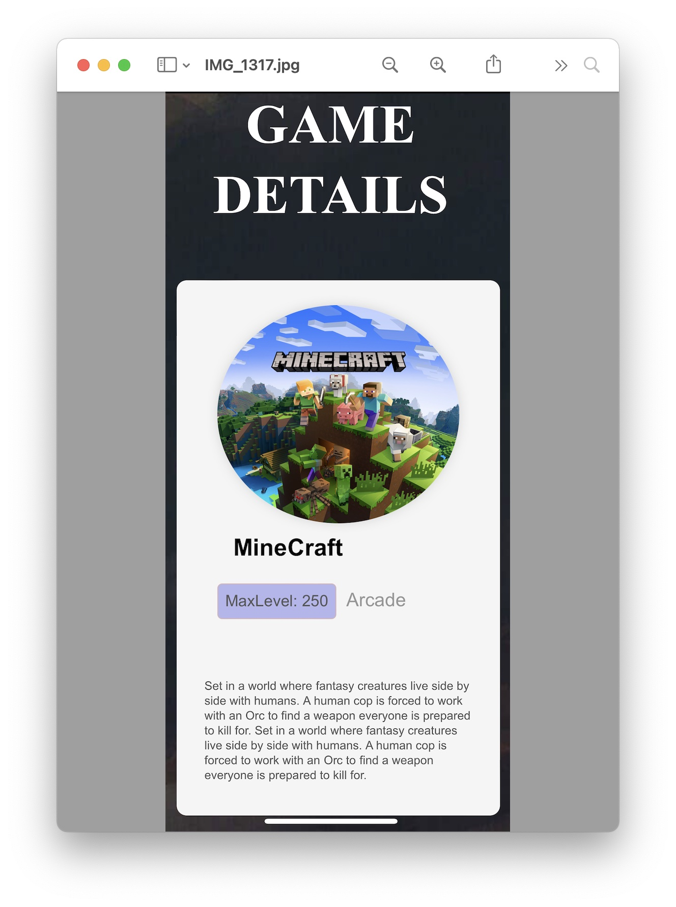
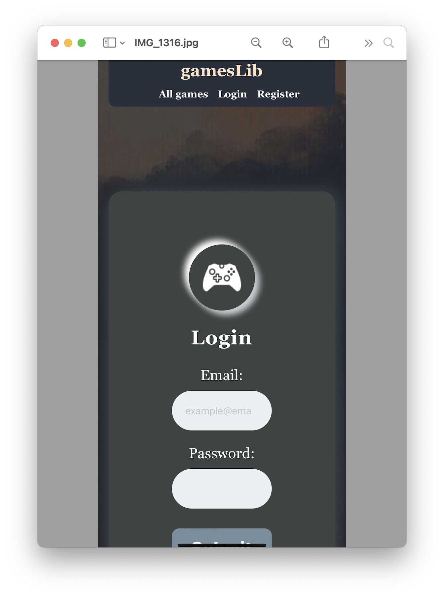

##  Desktop Web App Live demo at:

https://stefpetrov.github.io/Games-Library-React

I am currently working on Responsive design...

## Screenshots of the project on Desktop:

## Screenshots of the project on Mobile:

## How to run the app on your computer:

1. You can download the project ZIP file or you can clone the repository directly.   
2. Open the project with IDE/Code Editor.   
3. Open terminal with Ctrl + J.   
4. Navigate to the app folder.    
5. Type npm i to install all modules that are listed on package.json file and their dependencies.   
6. Type npm start to run the project in the browser. It will start on http://localhost:3000, but you can change it to another if necessary. Type y to do     it.    
7. Enjoy!

